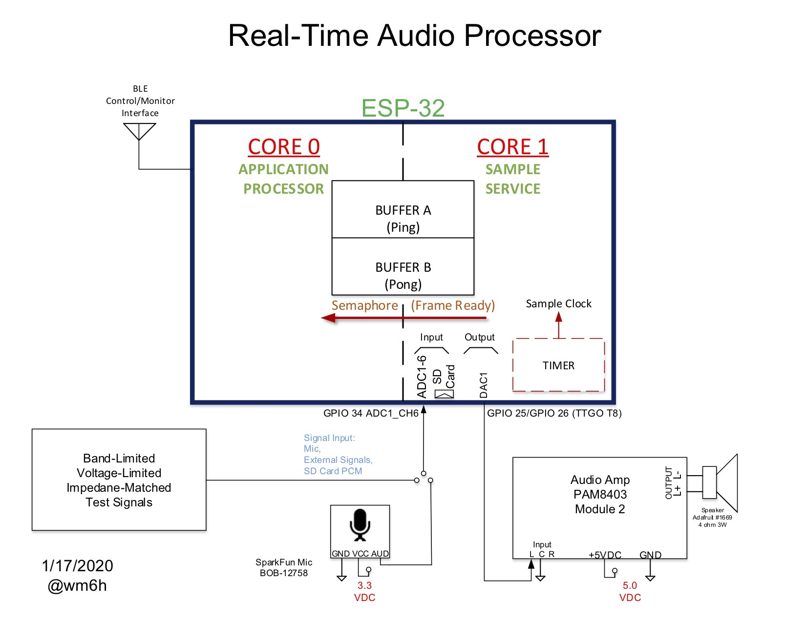
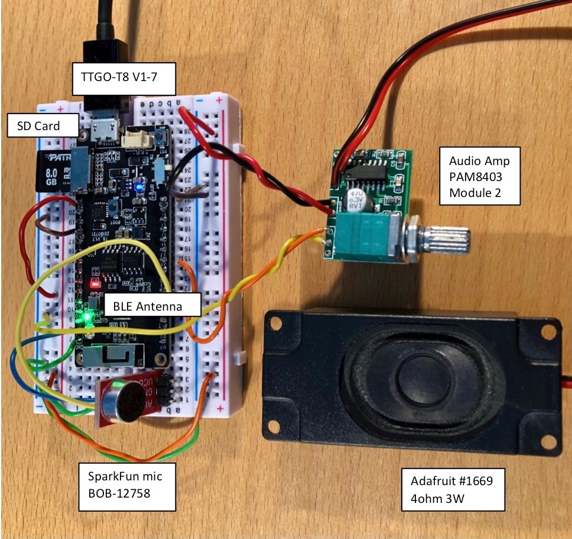

<H1 align="center"> Dual Core FIR Filter for the ESP32 </H1> 

This Arduino IDE compatible program uses the FIR filter library funtion in ANSI C from [Espressif DSP Library](https://docs.espressif.com/projects/esp-dsp/en/latest/esp-dsp-library.html#espressif-dsp-library) to perform Real-Time Digital Signal Processing.

The goal of this project is to evaluate the ESP32 processor and gain experience with the Espressif Digital Signal Processing Library of functions.  
The inexpensive hardware approach coupled with the familiar Arduino IDE simplifies experimenting and facilitates learning to code DSP applications.

The single-precision floating point filter coefficients are created in MATLAB or [on-line](http://t-filter.engineerjs.com) and examples are included for BandStop and HighPass filtering. 
Sample test input signal files are also included.

   NOTE: The micro-sdcard interface library must be installed manually in the Arduino IDE.

   [Installing Additional Arduino Libraries](https://www.arduino.cc/en/guide/libraries)

   Sketch->Include Library->Add .ZIP Library esp32-micro-sdcard-master.zip -- Check include library menu
   
Input test signals for processing may be created in the PC program [Audacity](https://www.audacityteam.org), transferred to a micro-sdcard, and installed in the ESP32 board. 
Samples are then read by the ESP32 from a file on the micro-sdcard as if they came from an ADC (Analog to Digital Converter), 
filtered by the DSP algorithm, and then output in Real-Time through the ESP32's DAC (Digital to Analog Converter) and heard on the speaker. 

Format for Audacity export: WAV format, 
8000 sps, single-track mono, WAV (Microsoft) signed 16-bit PCM. The SD card is formatted as FAT32.
REMEMBER to actually move the wav file to the micro-sdcard from the PC.

The ESP32 development hardware is the LILYGO® TTGO T8 V1.7 [ESP32 Module](https://www.tindie.com/products/ttgo/lilygor-ttgo-t8-v17-esp32-module/) 

Real-Time Samples at 8Ksps for voice audio range (< 4KHz) and computer game (tune style) low fidelity music. Not for high fidelity music.

To keep cost and complexity down, no switches or displays are included with the hardware design. Instead, program interfacing is accomplished over a BLE (Bluetooth Low Energy) wireless link.
Free phone apps from LightBlue or Nordic nRF Connect (iOS and Google play stores) are used to "Peak and Poke" program options to the filter program running on the ESP32. **See details below**.

Time permitting, I will demonstrate more of the Espressif DSP Library functions and also multi-rate filters from the Orfanidis book. These will be documented on my blog [dspobjects.com](https://www.dspobjects.com)

__________________________________________________________________

__________________________________________________________________
  

<H1 align="center"> DSP Done Dirt Cheap </H1> 
__________________________________________________________________
  

**BLE Scan**
The filter is switched in/out programmatically over a
Bluetooth Low Energy (BLE) wireless link. 
A write of a value to characteristic 
"beb5483e-36e1-4688-b7f5-ea07361b26a8" toggles the filter in/out
Use free phone apps from LightBlue or nRF Connect (Nordic) to
write values over BLE to the ESP32.

From either app, connect to BLE peripheral advertising name "DSP_FILTER"

**LightBlue** app: Upper Right--Change "Hex" to "UTF-8 String"--Write new value--then any character entered and written toggles the 400 Hz Bandstop/LowPass filter On/Off

**nRF Connect** app: After connect, slide to "Advertised Services" Window--tap the UP arrow--select UTF-8 Tab--enter any character--tap write

In the /ESP32DACWaveforms/TwoCoreSineESP32 program enter a positive integer frequency between 300 and 2000 to switch sine wave frequency. 

__________________________________________________________________
  
ref:

[Espressif DSP Library](https://docs.espressif.com/projects/esp-dsp/en/latest/esp-dsp-library.html#espressif-dsp-library)

[How to use Arduino ESP32 I2S (external DAC and built-in DAC) to play wav music file from sdcard](http://www.iotsharing.com/2017/07/how-to-use-arduino-esp32-i2s-to-play-wav-music-from-sdcard.html)

[Installing Additional Arduino Libraries](https://www.arduino.cc/en/guide/libraries)

[esp32 arduino ide](https://github.com/espressif/arduino-esp32)

[DSP library for ESP-IDF](https://github.com/espressif/esp-dsp)

[dspobjects.com](https://www.dspobjects.com)
